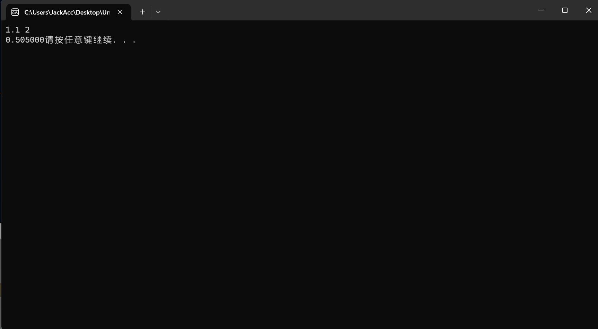
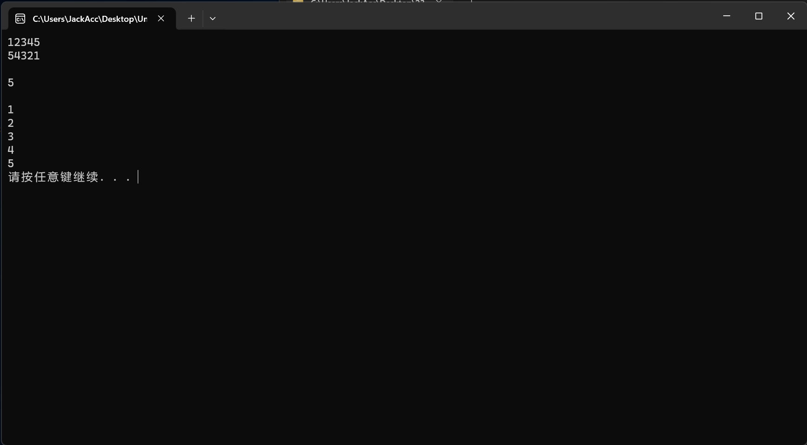
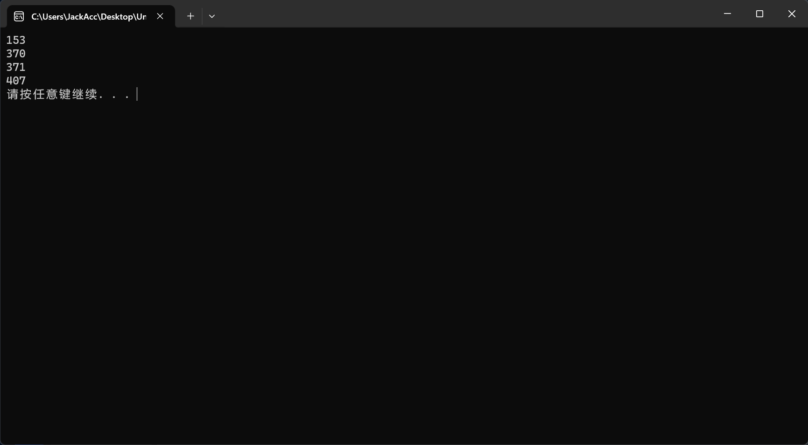
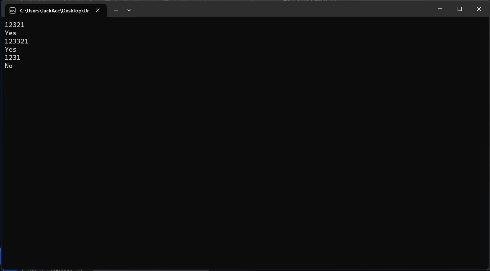
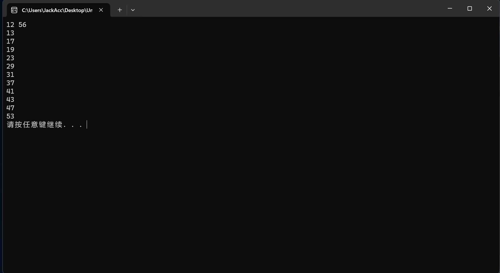

### 01 公式计算

``` #include<stdio.h>
#include<stdio.h>
#include<stdlib.h>
#include<math.h>
int main(){
	float x,a=1.0,b=1.0;int n,i;
	scanf("%f",&x);scanf("%d",&n);
	
	for(i=1;i<=n;i++){
		//printf("%d",i);
		a*=(-x)/(i*1.0);
		//printf("%f",a);
		b+=a;
	}
	printf("%f",b);
	system("pause");
	return 0;
}
```

### 运行示例



------

### 02 位数

``` #include<stdio.h>
#include<stdio.h>
#include<stdlib.h>
#include<math.h>
int main(){
	int a,i=1,c;int j[5]={-1};
	//printf("%d",j[4]);
	scanf("%d",&a);
	while (a/10>=1){
		c=a-a/10*10;printf("%d",c);j[i-1]=c;a/=10;i++;
	} 
	printf("%d\n\n",a);printf("%d\n\n",i);j[i-1]=a;
	while (i>0){
		i--;printf("%d\n",j[i]);
	}
	system("pause");
	return 0;
}
```

### 运行示例



------

### 03 水仙花数

``` #include<stdio.h>
#include<stdio.h>
#include<stdlib.h>
#include<math.h>
int main(){
	for (int i=100;i<999;i++)
	{
		//printf("%d\n",int(pow(int(i/100),3.0)+int(pow((int(i/10)-int(i/100)*10),3.0))+int(pow(i-int(i/10)*10,3.0))));
		if (pow(int(i/100),3.0)+pow((int(i/10)-int(i/100)*10),3.0)+pow(i-int(i/10)*10,3.0)==i)
		{
			
			printf("%d\n",i);
	}}
	system("pause");
	return 0;
}
```

### 输出结果



------

### 04 对称数

``` 
#include<stdio.h>
#include<stdlib.h>
#include<math.h>
int main(){
	int a,i=1,c,d=0,b;
	scanf("%d",&a);b=a;
	while (a/10>=1){
		c=a-a/10*10;d=d*10+c;a/=10;i++;
	} 
	d=d*10+a;
	if (b==d){printf("Yes\n");
	}
	else{
		printf("No\n");
	}
	system("pause");
	return 0;
}
```

### 输出示例(调试的时候为了一次测试多组加了个循环)



------

### 05 素数

``` 
#include<stdio.h>
#include<stdlib.h>
#include<math.h>
//int Isprime(int x);
int Isprime(int x){
	int x1=sqrt(x);
	for (int i=2;i<=x1;i++)
	{
		if (x%i==0){
			return 0;
		}
	}
	return 1;
}
int main(){
	int m,n;
	scanf("%d%d",&m,&n);
	if (m>n){
	int b;m=b;m=n;n=b;
	}
	while (m<=n){
	if (Isprime(m))
	{
		printf("%d\n",m);
	}m++;}
	system("pause");
	return 0;
}
```

### 输出示例


